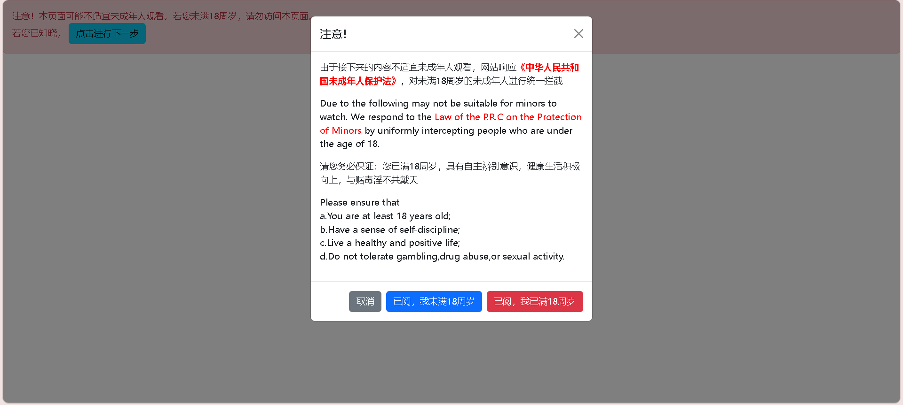
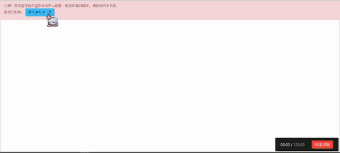

:::warning
本篇博客改编于旧版博客系统的B20230314。
:::

## 前言

一直都想给好朋友一个惊喜，但很不巧，总是无从下手，怎么办？

有的时候，最好的惊喜就是那些出其不意的瞬间。

既然如此，就对你的好朋友使用那首经典神曲——

《**Never Gonna Give You Up**》吧！

## 立意

我们期望，通过制作一个伪造的“小网站”，诱导好朋友点击，从而达到整蛊的效果。据此确立我们的战略目标。

序号|目标
---|---
1|不易被揭开的伪装
2|突然出现，出其不意
3|出现后立即自动播放
4|全屏显示

## 代码

### HTML

首先，我们需要搭建一个html的基础框架：

```html
<!DOCTYPE html>
<html>
    <head>
        <meta charset="UTF-8"/>
        <title>❤️❤️在线免费❤️❤️学习资料❤️❤️高清无码❤️❤️</title>
        <link rel="stylesheet" href="https://cdn-auxiliaries.southcat.cc/libfiles/bootstrap.css"/>
    <body>
		<script type="text/javascript" src="https://cdn-auxiliaries.southcat.cc/libfiles/bootstrap.js" charset="UTF-8"></script>
        <div id="already">
            <div class="alert alert-danger alert-dismissible fade show" role="alert" id="waralert">
                注意！本页面可能不适宜未成年人观看。若您未满18周岁，请勿访问本页面。
                <br/>
                若您已知晓，
                <button type="button" class="btn btn-info" data-bs-toggle="modal" data-bs-target="#2FC">
                    点击进行下一步
                </button>
            </div>
            <div class="modal fade" id="2FC" tabindex="-1" aria-labelledby="2FC-content" aria-hidden="true" role="modal">
                <div class="modal-dialog">
                    <div class="modal-content">
                        <div class="modal-header">
                            <h1 class="modal-title fs-5" id="2FC-content">注意！</h1>
                            <button type="button" class="btn-close" data-bs-dismiss="modal" aria-label="Close"></button>
                        </div>
                        <div class="modal-body">
                            <p>由于接下来的内容不适宜未成年人观看，网站响应<strong style="color: red;">《中华人民共和国未成年人保护法》</strong>，对未满18周岁的未成年人进行统一拦截</p>
                            <p>Due to the following may not be suitable for minors to watch. We respond to the <a style="color: red;">Law of the P.R.C on the Protection of Minors</a> by uniformly intercepting people who are under the age of 18.</p>
                            <p>请您务必保证：您已满18周岁，具有自主辨别意识，健康生活积极向上，与赌毒淫不共戴天</p>
                            <p>Please ensure that <br/>a.You are at least 18 years old;<br/>b.Have a sense of self-discipline;<br/>c.Live a healthy and positive life;<br/>d.Do not tolerate gambling,drug abuse,or sexual activity.</p>
                        </div>
                        <div class="modal-footer">
                            <button type="button" class="btn btn-secondary" data-bs-dismiss="modal" id="cancel">取消</button>
                            <button type="button" class="btn btn-primary" data-bs-dismiss="modal">已阅，我未满18周岁</button>
                            <button type="button" class="btn btn-danger" data-bs-dismiss="modal" id="accept">已阅，我已满18周岁</button>
                        </div>
                    </div>
                </div>
            </div>
        </div>
	</body>
</html>
```
:::tip
笔者在这里使用了Bootstrap的框架，其中CDN来自笔者个人仓库，若有需求，你可以将其进行替换成你自己的。
:::

代码完成后，你的浏览器理应显示以下界面：



### javascript

在HTML中插入以下语句：
```html
<video id="rick" src="https://vdse.bdstatic.com/192d9a98d782d9c74c96f09db9378d93.mp4" loop hidden width="100%" height="100%"></video>
<script type="text/javascript">
	var accepted=document.getElementById("accept"),
		video=document.getElementById("rick"),
		waralert=document.getElementById("waralert");
	function readyaccept(){
		video.removeAttribute("hidden");
		waralert.hidden=true;
		video.play();
		const{documentElement}=document;
		if(documentElement.requestFullscreen)documentElement.requestFullscreen();
		else if(documentElement.mozRequestFullScreen)documentElement.mozRequestFullScreen();
		else if(documentElement.webkitRequestFullscreen)documentElement.webkitRequestFullscreen();
		else if(documentElement.msRequestFullscreen)documentElement.msRequestFullscreen();
	}
	accepted.addEventListener("click",readyaccept);
</script>
```
:::tip
推荐在第39-40行中间插入本段。
:::

## 成果检验

完成以上代码后，你的页面应该是这样的：



## 后记

这个视频是百度来的。当然，有需求的话你也可以把它换为你中意的视频链接:spoiler[最好是缓冲时间很短的链接，否则效果将会大打折扣！]

其他的也就没什么了，祝你成功吧！