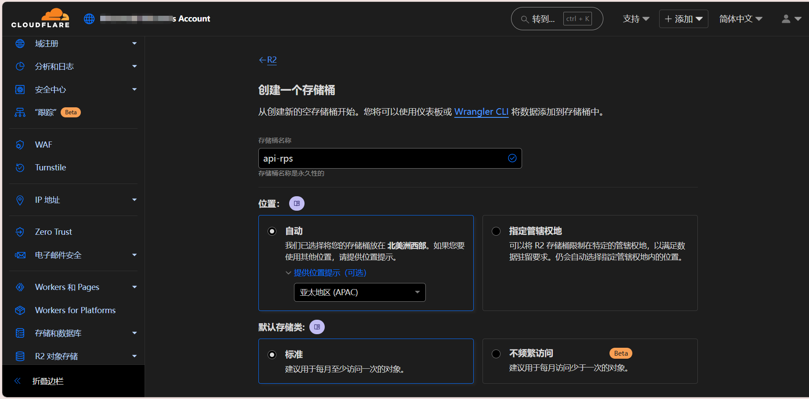
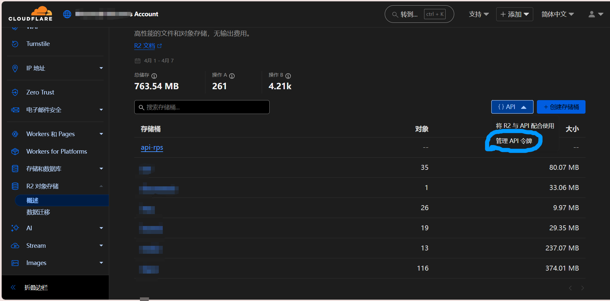
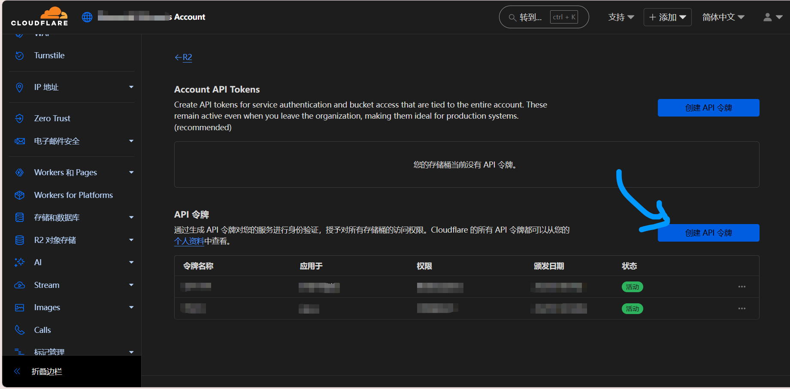
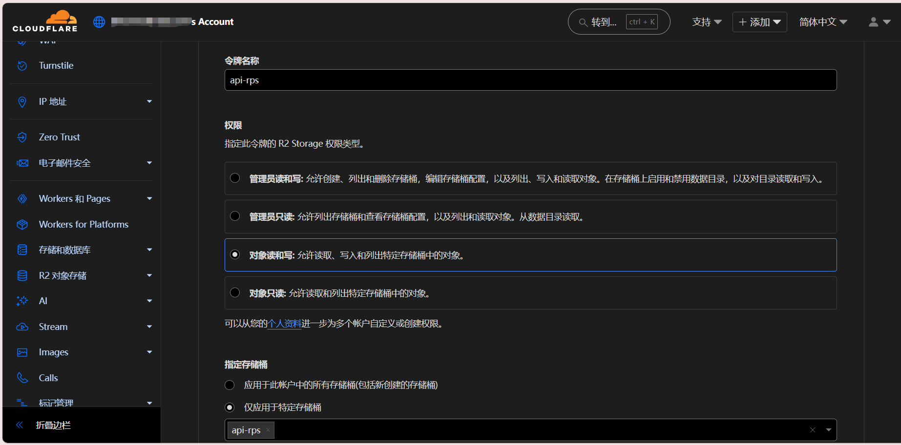
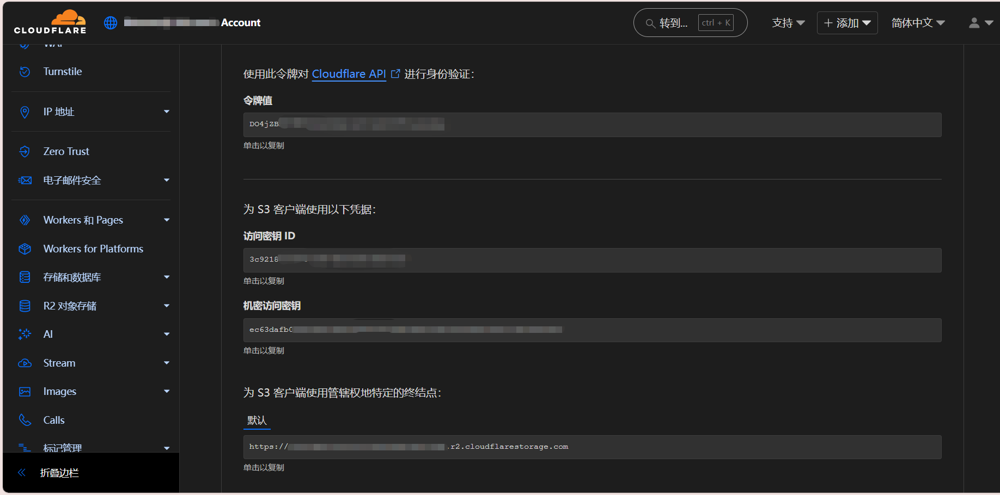

:::warning
本篇博客改编于旧版博客系统的B20250311。
:::

## 前言

看着别人搭建的api每刷一次新就能展现出不同的美图，你是否心动了呢？

心动不如行动，现在就开始吧！

:::tip
**本站例子可详见：**<a target="_blank" href="https://api-rps.southcat.cc">api-rps.southcat.cc</a>
:::

工欲善其事，必先利其器。在一切的开端之前，你需要准备做好这些准备：

- 一个Cloudflare账户

- 你相册里的精美图片

## 云台开山立柜府 秘钥生成定乾坤

打开Cloudflare仪表板→R2对象存储→创建存储桶（**如下图所示**）

:::tip
存储桶名称你可随意填写，笔者在此以api-rps为例。

位置**建议**调整为**亚太地区**。
:::

完毕后，返回R2主页，然后如下图操作：点击API→管理API令牌（蓝圈示意）

点击“创建API令牌”（蓝色箭头示意）

然后就是这样的：

:::tip
令牌名称你可随意填写，笔者在此以api-rps为例，

权限选择对象读和写即可，

其他的设置按需调整。
:::

点击完成，你便会进入这个页面：

:::caution

千万注意，这个页面暂且不要关闭！这些密钥只会显示一次！一旦关掉就得推翻重来！

:::

